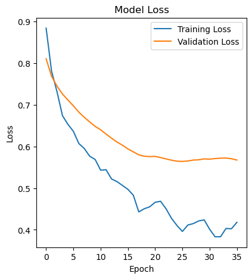
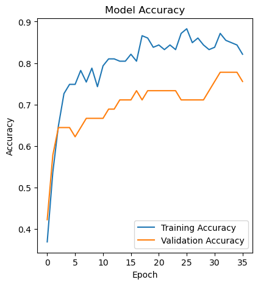

# team2_project4
Project 4: Advanced Machine Learning
All columns were used as features, no categorical data in dataset

## Auto Optimization
Trial 60 Complete [00h 00m 04s]
val_accuracy: 0.6266666650772095

Best val_accuracy So Far: 0.8133333325386047
Total elapsed time: 00h 03m 21s

### Best Model Hyperparameters
{'activation': 'tanh',
 'first_units': 9,
 'num_layers': 3,
 'units_0': 5,
 'units_1': 3,
 'units_2': 5,
 'units_3': 1,
 'units_4': 1,
 'units_5': 3,
 'tuner/epochs': 20,
 'tuner/initial_epoch': 7,
 'tuner/bracket': 1,
 'tuner/round': 1,
 'tuner/trial_id': '0020'}

 ### Results on Test Dataset
Loss: 0.5096867084503174, Accuracy: 0.8133333325386047

## Manual Optimization
### 1st Attempt
L1: U = 9, activation = tanh
L2: U = 36, A = tanh
L3: U = 1, A = tanh
params = 514
Loss: 0.788856029510498, Accurac: 0.746666669845581

### 2nd Attempt
L1: U = 50, activation = relu
L2: U = 100, A = relu
L3: U = 1, A = sigmoid
params = 5851
Loss: 0.531, Accurac: 0.853

### 3rd Attempt
L1: U = 50, activation = LeakyReLU
L2: U = 100, A = relu
L3: U = 1, A = sigmoid
params = 5851
Loss: 0.463, Accurac: 0.853

### 4th Attempt
L1: U = 50, activation = LeakyReLU
L2: U = 100, A = relu
L3: U = 100, A = relu
L4: U = 1, A = sigmoid
params = 15,951
Loss: 1.069, Accurac: 0.813

### 5th Attempt
L1: U = 9, activation = LeakyReLU
L2: U = 36, A = relu
L3: U = 1, A = sigmoid
params = 514
Loss: 0.479, Accurac: 0.800

### 6th Attempt
L1: U = 9, activation = tanh
L2: U = 36, A = relu
L3: U = 1, A = sigmoid
params = 514
Loss: 0.473, Accurac: 0.747

### 7th Attempt - Prevent Overfitting

### 8th Attempt - Cross Validation 

### 9th Attempt - Addressing the Warings from Overfitting
L1: U: 50, activation = LeakyReLU(negaitve_slope) - addresses 'Input(shape) warning
L2: U: 100, A = relu
L3: U: 1, A = sigmoid
Loss: 0.517, Accurac: 0.84

### Model Loss Plot

Training Loss (blue line):

The training loss starts quite high, around 0.88, and then decreases rapidly over the first 10 epochs.
This indicates the model is learning quickly and effectively from the training data during the initial stages of training.
The training loss continues to decrease, though at a slower pace, and eventually stabilizes around 0.4, suggesting the model has captured the main patterns in the training data.

Validation Loss (orange line):

The validation loss follows a similar trend to the training loss, but with some notable differences.
Initially, the validation loss is slightly higher than the training loss, which is expected as the validation data is independent and unseen by the model during training.
Around epoch 10, the validation loss starts to diverge from the training loss, increasing while the training loss continues to decrease.
This gap between the training and validation loss indicates that the model is starting to overfit to the training data and not generalize well to the validation data.
However, the validation loss eventually levels off and even starts to decrease again, suggesting the model has reached a point where it can generalize better to the unseen validation data.

Interpretation:

The overall shape of the loss curves suggests that the model is learning effectively, with the training loss decreasing steadily.
The initial divergence between the training and validation loss indicates a period of overfitting, but the model appears to have recovered from this and found a better balance between training performance and generalization.
The stabilization of the validation loss towards the end of training implies that the model has reached a point where it is no longer improving significantly, and further training may not yield substantial gains.

In summary, this loss curve shows a typical learning pattern, where the model initially learns rapidly from the training data, experiences a period of overfitting, and then finds a balance between training performance and generalization. The stabilization of the validation loss towards the end suggests that the model has reached a point of diminishing returns, and further training may not be necessary.

### Training Accuracy Plot

Training Accuracy (blue line):

The training accuracy starts around 0.55 and then fluctuates significantly in the early epochs, indicating the model is still learning and finding the right patterns in the training data.
Around epoch 10, the training accuracy begins to stabilize and increase more steadily, reaching a peak of around 0.85 towards the end of training.
The consistent increase in training accuracy suggests the model is learning effectively from the training data and improving its ability to correctly classify the examples.

Validation Accuracy (orange line):

The validation accuracy follows a similar but more volatile trend compared to the training accuracy.
Initially, the validation accuracy is lower than the training accuracy, which is expected as the validation data is independent and unseen by the model during training.
Around epoch 10, the validation accuracy starts to diverge from the training accuracy, fluctuating quite a bit and not increasing as steadily.
This gap between the training and validation accuracy indicates that the model may be overfitting to the training data and not generalizing as well to the validation data.
Towards the end of training, the validation accuracy stabilizes around 0.75, which is lower than the peak training accuracy.

Interpretation:

The overall shape of the accuracy curves suggests that the model is initially struggling to learn effectively, with the training and validation accuracy fluctuating significantly.
As training progresses, the model starts to capture the main patterns in the training data, leading to a more consistent increase in training accuracy.
However, the divergence between the training and validation accuracy, as well as the lower stabilized validation accuracy, indicates that the model may be overfitting to the training data and not generalizing well to unseen data.

In summary, this accuracy curve shows the model's learning process, where it initially struggles to learn effectively but eventually improves its training performance. However, the gap between the training and validation accuracy suggests the model may be overfitting, and further steps may be needed to improve its generalization capabilities.

So, the final evaluation metrics of 0.517 loss and 0.84 accuracy are likely the true performance of the model on the unseen test data, which is the ultimate measure of its effectiveness. The discrepancy with the trends shown in the loss and accuracy plots is due to the early stopping mechanism and potential differences between validation and test set performance.
This is a common phenomenon in machine learning, where the final model performance may not exactly match the trends observed during the training process. The key is to focus on the overall learning dynamics shown in the plots and the final test set performance as the most reliable measure of the model's capabilities.