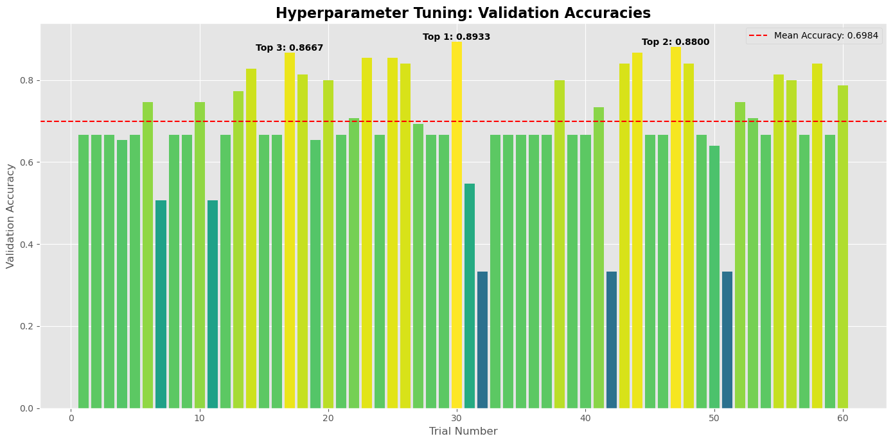
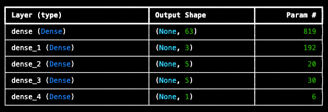
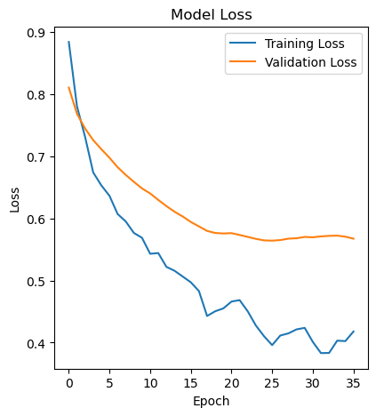
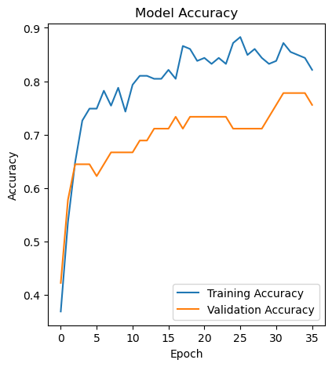

# Team 2 - Project 4: Advanced Machine Learning

## Overview
This project focuses on developing and optimizing a neural network model using TensorFlow and KerasTuner to achieve high accuracy on the heart failue dataset. Key aspects include hyperparameter tuning, manual optimization, and evaluation of the model's performance on test data.

---

## Neural Network Model

- **Framework**: TensorFlow
- **Features**: All columns in the dataset were used as features. The dataset contains no categorical data.

---

## Auto Optimization

### Methodology
- **Tool**: KerasTuner was used to optimize hyperparameters for the neural network model.
- **Performance Metrics**:
  - Best Validation Accuracy: **0.893**
  - Total Elapsed Time: **3 minutes 24 seconds**



**Insights**:
- The highest validation accuracy achieved was **0.893**.
- The second and third highest validation accuracies were **0.880** and **0.867**, respectively.
- Mean validation accuracy across trials was **0.698** (denoted by the red dashed line).

This plot highlights significant variation in validation accuracy across trials, with some configurations performing much better than others.

### Best Hyperparameters
```json
{
  "activation": "tanh",
  "first_units": 63,
  "num_layers": 3,
  "units_0": 3,
  "units_1": 5,
  "units_2": 5,
  "units_3": 3,
  "units_4": 5,
  "tuner/epochs": 20,
  "tuner/initial_epoch": 0,
  "tuner/bracket": 0,
  "tuner/round": 0
}
```
- **Total Parameters**: 1,067



---

## Results on Test Dataset
- **Loss**: 0.400
- **Accuracy**: **0.893**

---

## Manual Optimization

### Optimization Attempts and Results
1. **Using Auto-Optimized Parameters**:
   - Architecture: Layers with 63, 3, 5, 5, and 1 units (all using `tanh` activation)
   - Parameters: 1,067
   - Results: Loss = **0.556**, Accuracy = **0.853**

2. **Testing Activation Functions**:
   - Architecture: Layers with 50, 100, and 1 units (activations: `relu`, `relu`, `sigmoid`)
   - Parameters: 5,851
   - Results: Loss = **0.355**, Accuracy = **0.880**

3. **Testing LeakyReLU Activation**:
   - Architecture: Layers with 50, 100, and 1 units (activations: `LeakyReLU`, `relu`, `sigmoid`)
   - Parameters: 5,851
   - Results: Loss = **0.388**, Accuracy = **0.853**

4. **Increased Epochs (20 → 50)**:
   - Same architecture as Attempt #2
   - Results: Loss = **0.605**, Accuracy = **0.800**

5. **Preventing Overfitting**:
   - Parameters: 5,851
   - Results: Loss = **0.514**, Accuracy = **0.840**

6. **Cross-Validation**:
   - Results: TBD

7. **Addressing Overfitting Warnings**:
   - Architecture: Adjusted activations with `LeakyReLU` and `relu`
   - Results: Loss = **0.517**, Accuracy = **0.840**

---

## Model Evaluation

### Loss Curve


- **Training Loss**:
 The plot shows the model loss during training and validation over the course of 20 epochs. The blue line represents the training loss, which starts high and then decreases rapidly over the first few epochs before leveling off. The orange line represents the validation loss, which also starts high and decreases over time, but not as dramatically as the training loss. The overall trend shows that the model is learning effectively, with the training loss and validation loss both declining as the number of training epochs increases.
### Accuracy Curve


**Training Accuracy**:
  The image shows a plot of model accuracy over multiple epochs. There are two lines on the plot:

The blue line represents the training accuracy of the model. This shows how well the model is performing on the training data as the training progresses over the epochs.
The orange line represents the validation accuracy of the model. This shows how well the model is generalizing to unseen data, i.e., the validation data, as the training progresses.

The plot illustrates how the training accuracy and validation accuracy of the model change over the course of 15 epochs. Overall, the training accuracy appears to be increasing, while the validation accuracy shows more fluctuation but a general upward trend as well.

---

## Key Takeaways
1. **Learning Dynamics**:
   - Initial overfitting was mitigated with adjustments.
   - Training loss and accuracy trends indicate effective learning from the data.
   - Validation performance highlights room for improvement in generalization.

2. **Final Test Metrics**:
   - **Loss**: 0.517
   - **Accuracy**: 0.840
   - These metrics reflect the true performance on unseen data.

3. **Optimization Insights**:
   - Hyperparameter tuning played a critical role in achieving high validation accuracy.
   - Manual optimizations provided insights into the impact of activation functions and overfitting prevention techniques.

---

## Conclusion
This deep learning model highlights the iterative process of training, optimizing, and evaluating a neural network. Through a combination of automated and manual tuning, the model achieved a test accuracy of 0.893, demonstrating its potential to perform effectively on unseen data while maintaining strong generalization. Given its application in the early detection of individuals at risk for cardiovascular diseases, the model shows promise as an initial screening tool. However, further improvements are essential to enhance its accuracy and reliability.

#### Recommended next steps include:

- Expanding the training dataset to improve model robustness.
- Analyzing the data for outliers and addressing inconsistencies.
- Integrating related datasets to introduce new features that may enhance predictive performance.

---
